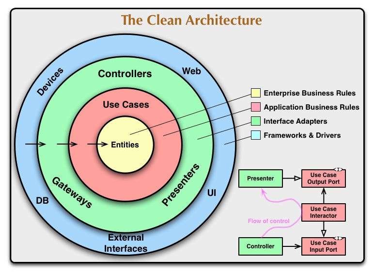

# CleanArchitecture

## CleanArchitecture란?

소프트웨어를 여러 계층으로 나누고, 각 계층이 하나의 책임만 가지도록 하여 관심사를 분리하는 아키텍쳐

(이 아키텍쳐가 가능하게 하는 중요한 요소는 **의존규칙**)

### CleanArchitecture의 목표

- 핵심 비즈니스 로직이 특정 프레임워크나 라이브러리에 종속되지 않아야 함
- 비즈니스 로직은 UI, DB, 웹 서버 또는 기타 외부 요소 없이 테스트할 수 있음
- UI를 변경하더라도 비즈니스 로직은 수정하지 않아도 됨
- 비즈니스 로직이 DB에 바인딩 되지 않음
    - 데이터 저장 방식에 직접 의존하지 않는다는 뜻
    ****저장 방식이 바뀌어도 비즈니스 로직은 수정할 필요가 없도록 Repository를 통해
    추상화하는 것이 Clean Architecture의 핵심
- 비즈니스 로직은 outside world에 대해 전혀 알지 못함

클린아키텍쳐의 핵심은 관심사의 분리이며, 각 계층(Layer)이 독립적이고 명확한 채임을 가지도록 설계하는 것

### **Dependency Rule**

- 소스코드 **종속성은 안쪽으로만 향할 수 있음** (안쪽에서 바깥쪽으로 의존하면 ❌)
- inner circles 안에 있는 것들은 outer circles에 대해 아무것도 알 수 없음
- 안쪽 계층일수록 핵심 비즈니스 규칙을 담고 있으므로 변경이 가장 적어야 함
- 바깥 쪽은 자주 변경될 수 있는 저수준의 컴포넌트들, 안쪽일수록 변경점이 적은 고수준의 컴포넌트들
- 특히, outer circles에 선언된 이름은 inner circles에서 언급해서는 안됨 (함수, 클래스 등)

## CleanArchitecture의 구조

<aside>

### Presentation Layer (MVVM)

</aside>

---

<aside>

### Domain Layer (Business Logic)

</aside>

---

<aside>

### Data Layer (Data Repositories)

</aside>

---

### 🧷 Presentation Layer (Domain Layer 의존)

화면에 보이는 영역을 담당하는 레이어

MVVM에서는 View와 ViewModel이 여기에 해당

사용자의 이벤트에 대한 처리 담당

왜 ViewModel이 Presentation Layer에 속할까?
→ 이제 ViewModel은 비즈니스 로직을 직접 구현하지 않고, 화면에 필요한 데이터에만 집중하게 됨

View, ViewController는 화면을 그리는 역할, ViewModel은 View에 그려질 데이터를 만드는 프레젠테이션 로직의 역할만 수행

### 🧷 Domain Layer

비즈니스 로직이 담겨있는 레이어 (최대한 변경을 지양해야함)

- Entities
- UseCases
- Repository Protocol(Interface)

CleanArchitecture 그래프의 가장 안쪽에 위치한 부분

Entities는 가장 안쪽에 있으므로 바깥쪽을 전혀 모르고, 다른 객체를 의존하지 않는 계층

Repository의 Protocol(Interface)은 Domain Layer에 위치
실제 구현(Implementation)은 Data Layer에 두어 Dependency Rule을 지킴

Domain Layer의 핵심 = 다른 레이어의 어떤 것도 포함시키면 안됨

### 🧷 Data Layer (Domain Layer를 의존)

Repository Implementation(구체타입)와 하나 이상의 Data Source를 포함

Repositories Implementation(구체타입), API(Network), Persistence(DB)들이 속함
(Repository Interface는 Domain Layer)

Data Source는 Network나 Local (Server, CoreData, Realm)

Repository Protocol은 Domain Layer에 있고, Data Layer는 이를 구현(Implement)

---

## CleanArchitecture의 사용 이유

MVVM을 통해서 View와 로직을 분리해낼 수 있지만, 앱이 복잡해지면서 ViewModel이 너무 많은 일을 하게 됨
→ 기존에 MVC에서 Massive Controller가 되어 문제가 발생하는 것처럼 Massive ViewModel이 될 수 있음

CleanArchitecture의 경우 전체적으로 역할분리를 세밀하게 함으로써
테스트가 용이해지고, 변경에 용이하게 대처할 수 있게 됨

MVVM에서 ViewModel이 담당하던 비즈니스 로직을 UseCase로 분리하여 역할을 더욱 명확하게 하고,
보다 유닛테스트를 더 분리해서 할 수 있게 됨

**명확한 역할, 책임 분리로 인해**

1. 확장성
2. 유지보수성
3. Testable

한 코드를 작성할 수 있게 된다!!