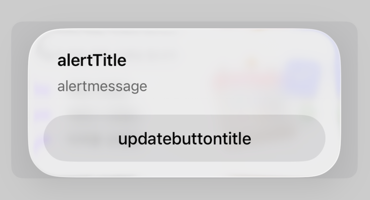

# Siren

## Siren이란?

App Store에서 현재 사용 가능한 앱 버전을 체크하여

사용자에게 업데이트 Alert을 띄워주는 것을 간편화 시킬 수 있는 프레임워크

[프레임워크 안쓰고 풀 코드로 Alert 설정하고 싶다면..](https://velog.io/@chaentopia/iOS-Swift-%EA%B0%95%EC%A0%9C-%EC%97%85%EB%8D%B0%EC%9D%B4%ED%8A%B8-Alert-%EC%84%A4%EC%A0%95)

## Siren 추가하기

<aside>

[https://github.com/ArtSabintsev/Siren](https://github.com/ArtSabintsev/Siren)

</aside>

## Alert 설정하기

### 들어가기 전에

- Siren은 App Store에 앱이 올라가있는 경우에만 사용
- AppDelegate나 SceneDelegate에서 `window?.makeKeyAndVisible()` 이후 코드에서 사용
- 원래 Siren은 위와 같이 AppDelegate 또는 SceneDelegate에 코드를 작성하지만
    
    나는 PiCK에 이 코드를 적용할 때 Delegate들이 더러워지는 게 싫어서
    
    따로 파일 생성 후 메서드를 만들어서 SceneDelegate에 호출하는 방식을 사용
    
- 기본값을 사용하는 경우도 있겠지만 커스텀을 99.9% 비율로 사용할 것 같기 때문에 커스텀만 서술

### Siren 파라미터

<aside>



그냥 텍스트만 적는다고 가정하면 실제 UI에 띄워지는 것들은 이것뿐

물론 지금은 무조건적인 업데이트 버튼밖에 없지만 다음에 업데이트 하기 같은

버튼 종류를 더 늘린다면 다른 파라미터들도 사용해야함!

</aside>

### 코드

📌 SirenConfiguration.swift

```swift
import Siren

public class SirenConfiguration {
    public static func setup() {
        let siren = Siren.shared
        
        siren.apiManager = APIManager(country: .korea) // 기준 위치 대한민국 앱스토어
        
        Siren.shared.presentationManager = PresentationManager (
//            appName: "appname",
            alertTitle: "PiCK 업데이트 알림",
            alertMessage: "원활한 서비스 이용을 위해 \n최신 버전으로 업데이트해 주세요.",
            updateButtonTitle: "업데이트",
            forceLanguageLocalization: .korean // 한국어 지원
        )
         Siren.shared.rulesManager = RulesManager(globalRules: .critical)
    }

    public static func check() {
        Siren.shared.wail()
    }
}
```

📌 SceneDelegate

```swift
import Siren // 상위에 import

---

    window?.makeKeyAndVisible() // 이 코드 이후에 작성
        
        SirenConfiguration.setup()
        SirenConfiguration.check()
    }
```

### 알람 시점 정의

- **Major 변경 시:** `majorUpdateRules` 적용
- **Minor 변경 시:** `minorUpdateRules` 적용
- **Patch 변경 시:** `patchUpdateRules` 적용

<aside>

globalRules에 알람 시점을 정의 하면 모든 변경 사항에 적용이 되고
globalRules 대신 각 항목에 업데이트 시점을 정의할 수도 있음

```swift
siren.rulesManager = RulesManager(
            majorUpdateRules: .critical,
            minorUpdateRules: .hinting,
            patchUpdateRules: .relaxed,
        )
```

</aside>

<aside>

**annoying**: (항상 확인) / 다음에 업데이트

**critical**: (항상 확인) / 즉시 업데이트

**default**: (하루 한 번) / 다음에 업데이트 / 버전 건너 뜀

**persistent**: (하루 한 번) / 다음에 업데이트

**hinting**: (일주일 한 번) / 다음에 업데이트

**relaxed**: (일주일 한 번) / 다음에 업데이트 / 버전 건너 뜀

</aside>


### 버전 체크 시점

<aside>

- **onDemand**: wail() 메소드가 불릴때만 체크
- **onForeground**: foreground 진입할때마다 체크

```swift
Siren.shared.wail(performCheck: .onDemand) { result in
  print(result)
}
```

</aside>